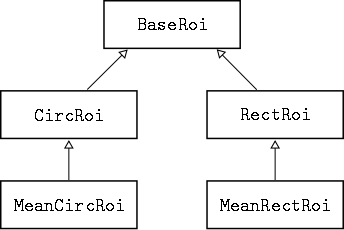
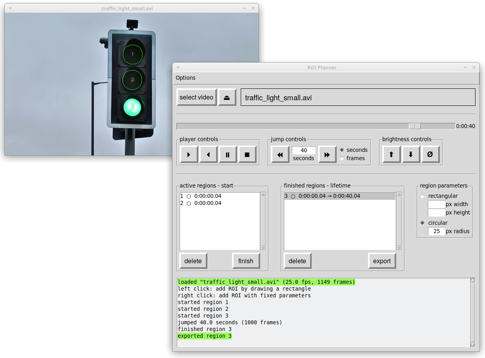

# roitools

Tools and helpers for planning and analyzing regions of interest (ROIs) in video files.

Author contact: tim.gebensleben@gmail.com

This software consists of three main parts:

- an easy to use wrapper/facade for the `cv2.VideoCapture` class called `PyCap` (`vidtools.py`)
- an observable subclass `RoiCap` to which regions of interest can be added as observers (`roitools.py`)
- a graphical user interface for planning ROIs (`roi_planner_gui.py`).

The next sections give a short overview of the essential features. Examples for functions building upon the tools provided are located in the `examples` directory.

## `PyCap` and `Frame` objects

The `PyCap` class is a wrapper for `cv2.VideoCapture` and acts as a video from which frames can be read.

It offers three main features:

- accessing and setting of attributes via the dot notation
- instances of `PyCap` are iterable
- iteration yields `Frame` objects which are `numpy` arrays with useful methods.

The following code snippets highlight the difference between a `VideoCapture` and a `PyCap`. They investigate a sample video between second ten and twelve and show each frame.

Using a `VideoCapture`:

```python
import cv2

video = cv2.VideoCapture('sample.avi')
video.set(cv2.CAP_PROP_POS_MSEC, 10000)

while True:
    success, frame = video.read()

    if not success:
        break

    msec = video.get(cv2.CAP_PROP_POS_MSEC)

    if msec > 12000:
        break

    # perform some operation on the frame here
    # ...

    cv2.imshow('sample.avi', frame)
    cv2.waitKey(25)
```

Equivalent code using a `PyCap`:

```python
from vidtools import PyCap, wait

video = PyCap('sample.avi')
video.pos_msec = 10000

for frame in video:
    if video.pos_msec > 12000:
        break

    # perform some operation on the frame here
    # ...

    frame.show()
    wait(25)
```

If no operation needs to be performed on the frame and the goal is to simply play the video, the second snippet can be simplified further.

```python
from vidtools import PyCap

video = PyCap('sample.avi')
video.play(delay=25, start=10000, stop=12000)
```

## ROIs and `RoiCap` objects

Classes implementing regions of interest are organized in the following hierarchy.



Only `MeanCircRoi` and `MeanRectRoi` instances collect any data from a video and serve as sample implementations. The other classes are bases for subclassing by the user.

The `RoiCap` class is derived from `PyCap` and allows registering ROIs as observers. Whenever a frame is read from a `RoiCap` instance (by implicit or explicit calls to `RoiCap.next`), all registered ROIs are automatically notified. After the notification, the outlines of the regions are drawn onto the current frame.

The code below registers a circular ROI centered at location (100, 100) and radius 20 px that collects the mean value of each BGR channel for every observed frame.

```python
from roitools import RoiCap, MeanCircRoi

video = RoiCap('sample.avi')
roi = MeanCircRoi((100, 100), 20)
video.add_roi(roi)
```

For the ROI to collect data over the course of the entire video, it is enough to generate every frame. (This may take a while.)

```python
for frame in video:
    pass
```

The collected data is appended to the list `roi.collected` and can be exported with the `to_file` method.

```python
with open('results.csv', 'w') as results:
    roi.to_file(results)
```

In order to implement a custom data collection logic, it is usually enough to inherit from one of the base classes and implement the `collect` method. The next example sets up a simple rectangular ROI that counts the amount of black pixels in every observed frame.

```python
from roitools import RectRoi
import numpy as np

class CountBlackRectRoi(RectRoi):
    def collect(self):
        '''called when observed RoiCap advances a frame,
        counts black pixels in current frame'''

        # cut out rectangular region from observed frame
        array = np.array(self.get_rect())

        # find black pixels and return their count
        is_black = ~array.any(axis=2)
        return is_black.sum()
```

The return value is automatically appended to the instance's `collected` list. For a longer example please see the implementation of `MeanRectRoi.collect` or `MeanCircRoi.collect`.

If the collected data needs to be exported, implementing a `to_file` method is suggested.

## ROI Planning

Planning the exact location and lifespan of regions of interest can be tedious without visual assistance. This software comes with a graphical user interface for the planning process. A screenshot is shown below.


